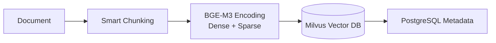
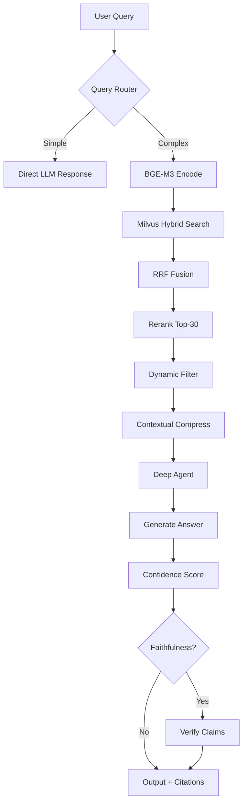

# RagMate

**Enterprise-Grade RAG Knowledge Management System**

[](https://www.python.org/downloads/)
[](LICENSE)
[](https://fastapi.tiangolo.com/)

[中文版](README_zh.md) · [English](README.md)

---

## 🎯 What is RagMate?

RagMate is a **self-hosted knowledge management system** that combines Retrieval-Augmented Generation (RAG) with advanced vector search and LLM reasoning. Upload your documents, build a searchable knowledge base, and get accurate answers with citations—**all data stays on-premise**.

### Why RagMate?

- ✅ **No vendor lock-in** — Self-hosted, full control over your data
- ✅ **Production-ready** — Hybrid search, confidence scoring, evaluation tools
- ✅ **Developer-friendly** — Clean architecture, comprehensive docs, easy deployment
- ✅ **Enterprise-grade** — Multi-format support, batch operations, streaming responses

---

## ✨ Key Features

### 🔍 Advanced Retrieval
- **Hybrid Search**: Dense (semantic) + Sparse (keyword) vectors with RRF fusion
- **Cross-Encoder Reranking**: BGE-Reranker-v2-m3 for precision
- **Dynamic Filtering**: Adaptive thresholds, source deduplication, contextual compression
- **Query Optimization**: Auto-rewrite follow-ups, smart routing for simple queries

### 🤖 Intelligent Agents
- **Deep Reasoning**: LangGraph-based multi-turn agents with sub-agent delegation
- **Streaming Output**: Real-time token-by-token SSE responses
- **Confidence Scoring**: High/Medium/Low badges based on retrieval quality
- **Faithfulness Check**: Optional verification to flag unsupported claims

### 📄 Document Management
- **Multi-Format Support**: PDF, DOCX, XLSX, TXT, Markdown
- **Smart Chunking**: Adaptive sizes per file type, parent-child retrieval, heading-aware splitting
- **Content Deduplication**: Hash-based prevention of duplicate indexing
- **Batch Operations**: Select multiple files for bulk ingest/delete with progress tracking

### 📊 Built-in Evaluation
- **RAGAS Integration**: Faithfulness, Answer Relevancy, Context Precision/Recall
- **Interactive CLI**: Generate test sets, run evaluations, view reports
- **CI/CD Gating**: Threshold-based pass/fail for automated quality checks

---

## 🚀 Quick Start

### Prerequisites

- Python 3.12+
- Docker Desktop (for infrastructure services)

### 1. Launch Infrastructure

```bash
docker-compose up -d
```

This starts:
- **Milvus** (19530) — Vector database
- **PostgreSQL** (5432) — Metadata & chat history
- **Redis** (6379) — Session cache & distributed locks
- **MinIO** (9000/9001) — Object storage
- **Attu** (8080) — Milvus admin UI

### 2. Install Dependencies

```bash
cd backend
pip install -e .
```

For RAGAS evaluation (optional):
```bash
pip install -e ".[eval]"
```

### 3. Configure

```bash
cp .env.example .env
```

Edit `.env` with your LLM credentials:

```env
LLM_API_KEY=your-api-key-here
LLM_MODEL=gpt-4o
LLM_API_BASE_URL=https://api.openai.com/v1
```

Supports any OpenAI-compatible API: DeepSeek, Anthropic, Claude, etc.

### 4. Start Server

```bash
uvicorn backend.app:app --reload --port 8000
```

Open **http://localhost:8000** in your browser.

---

## 📖 Usage

### Web Interface

**Chat Tab**: Ask questions about your documents with real-time streaming responses  
**Documents Tab**: Upload files, manage knowledge base, trigger ingestion

### API Endpoints

#### Chat
```http
POST /chat
{
  "message": "What is RAG?",
  "session_id": "optional"
}

POST /chat/stream  # Server-Sent Events
GET  /chat/sessions
GET  /chat/sessions/{session_id}
DELETE /chat/sessions/{session_id}
```

#### Documents
```http
GET    /documents
POST   /documents/upload  # multipart/form-data, max 50MB
DELETE /documents/{filename}
```

#### Ingestion
```http
POST /ingest              # Trigger indexing
GET  /ingest/status       # Check progress
```

#### Health Checks
```http
GET /health   # Basic health check
GET /ready    # Detailed service readiness
```

Full API docs: **http://localhost:8000/docs** (Swagger UI)

---

## 🏗️ Architecture

### Indexing Pipeline



1. **Chunking**: File-type-specific splitting (PDF/DOCX/TXT/Table/Markdown)
2. **Encoding**: BGE-M3 generates dual vectors (1024-dim dense + sparse)
3. **Storage**: Milvus stores vectors, PostgreSQL tracks metadata

### Query Pipeline



Key stages:
1. **Query Routing**: Simple queries skip retrieval for speed
2. **Hybrid Search**: Parallel dense + sparse ANN → RRF fusion
3. **Reranking**: Cross-encoder scores top-30 candidates
4. **Filtering**: Sigmoid threshold + score-gap detection + source dedup
5. **Compression**: Sentence-level relevance filtering
6. **Generation**: Deep agent with multi-turn reasoning
7. **Validation**: Optional faithfulness check (extra LLM call)

---

## ⚙️ Configuration

All settings via environment variables or `.env` file. Validated by `pydantic-settings`.

### Essential Settings

| Variable | Default | Description |
|----------|---------|-------------|
| `LLM_API_KEY` | *(required)* | Your LLM provider API key |
| `LLM_MODEL` | `gpt-4o` | Model name |
| `LLM_API_BASE_URL` | | Custom endpoint (e.g., DeepSeek, Claude) |
| `EMBEDDING_DEVICE` | `cpu` | `cpu` or `cuda` (GPU acceleration) |
| `DATABASE_URL` | `postgresql+asyncpg://...` | PostgreSQL connection |
| `REDIS_URL` | `redis://localhost:6379/0` | Redis connection |
| `MILVUS_HOST` | `localhost` | Milvus server address |

### Tuning Parameters

| Category | Variable | Default | Impact |
|----------|----------|---------|--------|
| **Chunking** | `CHUNK_SIZE` | 1000 | Larger = more context, lower precision |
| | `CHUNK_OVERLAP` | 200 | Maintains continuity between chunks |
| | `CHUNK_SIZE_PDF` | 600 | Smaller for technical docs |
| **Retrieval** | `RERANK_CANDIDATES` | 30 | More = better quality, slower |
| | `FINAL_CONTEXT_K` | 15 | Max chunks sent to LLM |
| | `RERANK_SCORE_THRESHOLD` | 0.3 | Discard low-relevance results |
| **Agent** | `QUERY_CONTEXTUALIZE` | `true` | Rewrite follow-up queries |
| | `FAITHFULNESS_CHECK` | `false` | Verify answer accuracy (+1 LLM call) |

See `.env.example` for all 30+ configuration options.

---

## 🧪 Evaluation

Built-in RAGAS evaluation for measuring RAG pipeline quality.

### Interactive Mode

```bash
cd backend
ragmate-eval
```

Guided workflow: generate test sets → run evaluation → view reports.

### CI/CD Mode

```bash
# Generate test set from uploaded documents
ragmate-eval generate --size 50 --output eval/testsets/testset.json

# Run evaluation
ragmate-eval evaluate --testset eval/testsets/testset.json \
  --report eval/reports/report.json

# Quality gate (exit non-zero if below threshold)
ragmate-eval evaluate --testset eval/testsets/testset.json \
  --threshold 0.75
```

**Metrics**: Faithfulness, Answer Relevancy, Context Precision, Context Recall, Factual Correctness

---

## 🛠️ Tech Stack

| Layer | Technology | Purpose |
|-------|-----------|---------|
| **Web Framework** | FastAPI + Uvicorn | Async REST API, serves frontend |
| **Frontend** | Vanilla HTML/CSS/JS | Zero-dependency, Apple HIG-inspired UI |
| **LLM** | LangChain ChatOpenAI | Any OpenAI-compatible API |
| **Embedding** | BAAI/bge-m3 | 1024-dim multilingual dual vectors |
| **Vector DB** | Milvus 2.5 | Hybrid search (dense + sparse + RRF) |
| **Reranker** | BAAI/bge-reranker-v2-m3 | Cross-encoder precision ranking |
| **Agent** | LangGraph (Deep Agents) | Multi-turn reasoning + tool calling |
| **Database** | PostgreSQL 15 | Document metadata, chat history |
| **Cache** | Redis 7 | Session state, distributed locks |
| **Storage** | MinIO | Milvus object storage backend |
| **Tracing** | LangSmith (optional) | Agent execution monitoring |

---

## 📂 Project Structure

```
RagMate/
├── docker-compose.yml          # Infrastructure orchestration
├── README.md                   # This file
├── backend/
│   ├── app.py                  # FastAPI factory, middleware, lifespan
│   │
│   ├── api/                    # HTTP route handlers
│   │   ├── chat.py            # /chat, /chat/stream, /chat/sessions
│   │   ├── documents.py       # /documents CRUD
│   │   ├── ingest.py          # /ingest status
│   │   └── deps.py            # Dependency injection helpers
│   │
│   ├── domain/                 # Business entities
│   │   ├── models.py          # SQLAlchemy ORM models
│   │   ├── schemas.py         # Pydantic validators
│   │   └── errors.py          # Typed error hierarchy
│   │
│   ├── infrastructure/         # External adapters
│   │   ├── config.py          # pydantic-settings configuration
│   │   ├── database.py        # PostgreSQL async engines
│   │   ├── redis_client.py    # Redis session/lock client
│   │   ├── milvus.py          # Milvus vector DB operations
│   │   ├── encoding.py        # BGE-M3 encoder
│   │   └── model_factory.py   # LLM factory
│   │
│   ├── core/                   # Domain logic
│   │   ├── retriever.py       # Hybrid search + reranking + filtering
│   │   ├── agent.py           # Deep Agent (LangGraph)
│   │   └── prompts/           # System prompt templates
│   │
│   ├── application/            # Use cases
│   │   ├── chat.py            # Chat orchestration (sync + stream)
│   │   ├── document_service.py # Document CRUD
│   │   ├── ingest_manager.py  # Ingest lifecycle management
│   │   └── ingest/            # Ingestion pipeline
│   │       ├── loaders.py     # PDF/DOCX/XLSX parsers
│   │       ├── db_sync.py     # PostgreSQL sync
│   │       └── pipeline.py    # Main orchestrator
│   │
│   └── eval/                   # RAGAS evaluation CLI
│       ├── cli.py             # Command-line interface
│       ├── metrics.py         # Metric computation
│       └── report.py          # Report generation
│
├── frontend/                   # Web UI (zero-dependency)
│   ├── index.html
│   ├── style.css              # Apple HIG design system
│   └── app.js
│
└── eval/                       # Evaluation data
    ├── testsets/              # Generated test sets
    └── reports/               # Evaluation reports
```

---

## 🔒 Security

- **Self-Hosted**: All data stored locally, no external dependencies
- **Upload Limits**: 50MB max file size (enforced via ASGI middleware)
- **Rate Limiting**: Redis-based per-IP throttling
- **Request Tracking**: UUID per request for audit trails
- **Input Validation**: Pydantic schemas for all API endpoints
- **CORS Control**: Configurable allowed origins

---

## 🧩 Development

### Running Tests

```bash
cd backend
pip install -e ".[test]"
pytest -v
```

### Code Quality

```bash
# Type checking
mypy backend/

# Linting
ruff check backend/

# Formatting
ruff format backend/
```

### Tracing (Optional)

Enable LangSmith for agent execution monitoring:

```env
LANGSMITH_TRACING=true
LANGSMITH_API_KEY=your-key
LANGSMITH_PROJECT=ragmate
```

---

## ❓ FAQ

**Q: Can I use local LLMs?**  
A: Yes! Set `LLM_API_BASE_URL` to your local endpoint (e.g., Ollama, LM Studio).

**Q: How much RAM do I need?**  
A: Minimum 8GB for CPU mode. BGE-M3 embedding model requires ~2GB. GPU recommended for production.

**Q: Which file formats are supported?**  
A: PDF, DOCX, XLSX/XLS, TXT, Markdown. Tables in spreadsheets are preserved as-is.

**Q: Can I customize chunking?**  
A: Yes, adjust `CHUNK_SIZE_*` and `CHUNK_OVERLAP_*` in `.env` per file type.

**Q: How do I backup my data?**  
A: Backup `volumes/` directory (PostgreSQL, Milvus, MinIO data). Stop services first for consistency.

---

## 📝 License

MIT License — see [LICENSE](LICENSE).

---

## 🙌 Acknowledgments

Built with amazing open-source tools:
- [FastAPI](https://fastapi.tiangolo.com/)
- [LangChain](https://python.langchain.com/)
- [Milvus](https://milvus.io/)
- [BGE Models](https://github.com/FlagOpen/FlagEmbedding)
- [RAGAS](https://docs.ragas.ai/)

---

**Ready to build your knowledge base?** Start with `docker-compose up -d` 🚀
