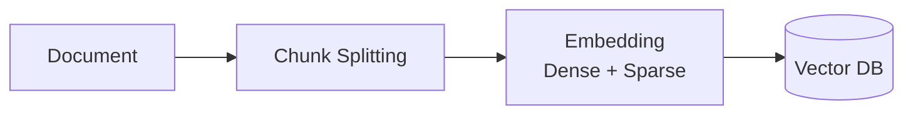
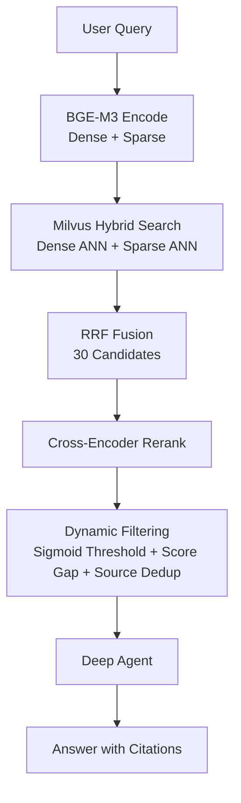

# RagMate

[中文版](README_zh.md)

An enterprise-grade knowledge management system based on Retrieval-Augmented Generation (RAG). Users upload documents, and the system retrieves the most relevant content from the knowledge base via vector search and LLM inference to generate accurate answers.

[](https://www.python.org/downloads/)
[](LICENSE)
[](https://fastapi.tiangolo.com/)

---

## Key Features

- **Hybrid Search** — Dense + Sparse vector hybrid search with RRF fusion + cross-encoder reranking + dynamic score filtering (sigmoid threshold, score-gap detection, adaptive source dedup)
- **Deep Agents** — LangGraph-based multi-turn reasoning agent with sub-agent delegation and complex query decomposition
- **Streaming Output** — SSE real-time token-by-token streaming
- **Multi-Format Documents** — PDF, DOCX, XLSX, TXT, Markdown support with content-hash deduplication
- **Smart Chunking** — Markdown split by heading hierarchy, PDF page numbers preserved, all chunks carry sequential metadata
- **Multilingual Embedding** — BAAI/bge-m3 (1024-dim), native dense + sparse dual vectors, locally deployed
- **Batch Operations** — Select multiple documents for batch ingest or batch delete with progress modal
- **Flexible LLM Integration** — Access any OpenAI-compatible API (OpenAI, Anthropic, DeepSeek, MiMo, etc.) via LangChain ChatOpenAI
- **Evaluation CLI** — Built-in RAGAS evaluation with CI/CD quality gating
- **Self-Hosted** — All data on-premise, no external dependencies

---

## Architecture

### Indexing Pipeline



- Chunk Splitting: Markdown split by heading, others use `RecursiveCharacterTextSplitter`
- Embedding: dense (semantic) + sparse (keyword) dual vectors
- Vector DB stores dual vectors + metadata (source, page, chunk_index)

### Query Pipeline



- BGE-M3 encodes query into dense (semantic) + sparse (keyword) vectors in one pass
- Milvus runs parallel ANN searches, fused via Reciprocal Rank Fusion
- Cross-encoder reranks 30 candidates, dynamic scoring selects 4-15 optimal chunks
- Deep Agents supports multi-step reasoning + sub-agent delegation

---

## Quick Start

### Prerequisites

- Python 3.12+
- Docker Desktop (for Milvus, PostgreSQL, Redis)

### 1. Start Infrastructure

```bash
docker-compose up -d
```

| Service | Port | Purpose |
|---------|------|---------|
| Milvus | 19530 | Vector database (dense + sparse) |
| Attu | 8080 | Milvus web admin UI |
| PostgreSQL | 5432 | Document metadata, chat history |
| Redis | 6379 | Session cache, distributed lock |
| MinIO | 9001 | Milvus object storage backend |

### 2. Install Dependencies

```bash
cd backend
pip install -e .
```

For RAGAS evaluation (optional):

```bash
pip install -e ".[eval]"
```

### 3. Configure

```bash
cp .env.example .env
```

Edit `.env` with your LLM API settings:

```env
LLM_MODEL=gpt-4o
LLM_API_KEY=your_api_key
LLM_API_BASE_URL=https://api.openai.com/v1
```

Supports any OpenAI-compatible API (DeepSeek, MiMo, etc.):

```env
LLM_MODEL=deepseek-chat
LLM_API_KEY=your_key
LLM_API_BASE_URL=https://api.deepseek.com/v1
```

### 4. Start Server

Run from the project root:

```bash
uvicorn backend.main:app --reload --port 8000
```

Open http://localhost:8000 in browser.

---

## Usage

### Web UI

- **Chat** — Knowledge-base powered streaming Q&A with multi-turn conversation
- **Documents** — Upload documents, manage documents, trigger ingestion

### RAGAS Evaluation

Evaluate your RAG pipeline quality with RAGAS metrics. Install eval dependencies and ensure infrastructure is running:

```bash
cd backend
pip install -e ".[eval]"

# Make sure Milvus, PostgreSQL, Redis are running
docker-compose up -d
```

Interactive mode (recommended):

```bash
ragmate-eval
```

CLI mode (for CI/CD):

```bash
# Generate test set
ragmate-eval generate --size 50 --output eval/testsets/testset_v1.json

# Run evaluation
ragmate-eval evaluate --testset eval/testsets/testset_v1.json --report eval/reports/report.json

# CI/CD gate — exit non-zero if overall score below threshold
ragmate-eval evaluate --testset eval/testsets/testset_v1.json --threshold 0.75
```

Metrics: Faithfulness, Answer Relevancy, Context Precision, Context Recall, Factual Correctness.

---

## API Reference

### Chat

```
POST /chat
Body: { "message": "...", "session_id": "optional" }
Response: { "response": "...", "session_id": "..." }
```

```
POST /chat/stream
Body: { "message": "...", "session_id": "optional" }
Response: text/event-stream
  data: {"token": "..."}
  data: {"done": true, "session_id": "..."}
```

```
GET /chat/sessions
Response: { "sessions": [{ "session_id": "...", "first_message": "...", "created_at": "..." }] }
```

```
GET /chat/sessions/{session_id}
Response: { "session_id": "...", "messages": [{ "role": "...", "content": "...", "created_at": "..." }] }
```

```
DELETE /chat/sessions/{session_id}
Response: { "success": true }
```

### Documents

```
GET /documents
Response: { "documents": [{ "filename": "...", "size_bytes": ..., "status": "...", "chunk_count": ... }] }
```

```
POST /documents/upload
Body: multipart/form-data, field name "file" (PDF/DOCX/XLSX/TXT/MD, max 50MB)
Response: { "filename": "...", "status": "uploaded" }
```

```
DELETE /documents/{filename}
Response: { "success": true }
```

### Ingestion

```
POST /ingest
Body: { "filenames": ["file1.pdf", "file2.docx"] } (optional, omit to ingest all new files)
Response: { "status": "started" | "already_running" }
```

```
GET /ingest/status
Response: { "status": "idle|running|success|failed", "document_count": ..., "chunk_count": ... }
```

### System

```
GET /health
Response: { "status": "ok" }

GET /ready
Response: { "status": "ready|degraded", "checks": { "milvus": ..., "postgresql": ..., "redis": ... } }
```

---

## Configuration

All settings are configured via `.env` file or environment variables, validated by `pydantic-settings`.

| Category | Variable | Default | Description |
|----------|----------|---------|-------------|
| **LLM** | `LLM_MODEL` | `gpt-4o` | Model name |
| | `LLM_API_KEY` | | API key |
| | `LLM_API_BASE_URL` | | Custom API endpoint |
| **Embedding** | `EMBEDDING_PROVIDER` | `huggingface` | `huggingface` or `openai` |
| | `EMBEDDING_MODEL` | `BAAI/bge-m3` | Embedding model |
| | `EMBEDDING_DEVICE` | `cpu` | `cpu` or `cuda` |
| | `EMBEDDING_NORMALIZE` | `true` | Normalize embeddings |
| | `HF_TOKEN` | | HuggingFace token |
| **Database** | `DATABASE_URL` | `postgresql+asyncpg://...` | PostgreSQL connection |
| | `REDIS_URL` | `redis://localhost:6379/0` | Redis connection |
| **Milvus** | `MILVUS_HOST` | `localhost` | Host |
| | `MILVUS_PORT` | `19530` | Port |
| | `MILVUS_COLLECTION` | `ragmate_docs` | Collection name |
| **Ingestion** | `CHUNK_SIZE` | `1000` | Text chunk size |
| | `CHUNK_OVERLAP` | `200` | Chunk overlap |
| **Retrieval** | `HYBRID_SEARCH_ENABLED` | `true` | Enable hybrid search |
| | `RERANKER_MODEL` | `BAAI/bge-reranker-v2-m3` | Reranker model |
| | `RERANK_CANDIDATES` | `30` | Rerank candidate pool size |
| | `FINAL_CONTEXT_K` | `15` | Max chunks passed to the LLM (hard cap) |
| | `RERANK_SCORE_THRESHOLD` | `0.3` | Sigmoid probability threshold (0-1) |
| **LangSmith** | `LANGSMITH_TRACING` | `false` | Enable tracing |
| | `LANGSMITH_API_KEY` | | LangSmith API key |

---

## Project Structure

```
RagMate/
├── docker-compose.yml
├── LICENSE / README.md / README_zh.md / CHANGELOG.md
├── eval/                          # RAGAS evaluation data
│   ├── testsets/                  # Generated test sets
│   └── reports/                   # Evaluation reports
├── frontend/
│   ├── index.html
│   ├── style.css
│   └── app.js
└── backend/
    ├── pyproject.toml
    ├── .env.example
    ├── main.py                    # Entry point (uvicorn backend.main:app)
    ├── app.py                     # FastAPI factory, middleware, lifespan
    ├── domain/                    # Business entities
    │   ├── errors.py              # Typed error hierarchy
    │   ├── models.py              # ORM models (Document, ChatHistory)
    │   └── schemas.py             # Pydantic request/response schemas
    ├── infrastructure/            # External system adapters
    │   ├── config.py              # Configuration (pydantic-settings)
    │   ├── database.py            # SQLAlchemy async/sync engines
    │   ├── redis_client.py        # Redis session / lock / status
    │   ├── rate_limiter.py        # Redis-based rate limiter
    │   ├── streaming_llm.py       # ChatOpenAI-compatible factory
    │   ├── model_factory.py       # LLM / Embedding factory
    │   ├── encoding.py            # BGE-M3 dense + sparse encoding
    │   └── milvus.py              # Milvus client management + CRUD
    ├── core/                      # Domain logic
    │   ├── retriever.py           # Hybrid search + Reranking + filtering
    │   └── agent.py               # Deep Agent (system prompt + retrieval_tool)
    ├── application/               # Use cases / services
    │   ├── chat.py                # Chat orchestration (sync + streaming)
    │   ├── document_service.py    # Document CRUD
    │   ├── ingest_manager.py      # Ingest task lifecycle (lock, async)
    │   └── ingest/                # Ingestion pipeline
    │       ├── loaders.py         # Document loading by extension
    │       ├── db_sync.py         # PostgreSQL document status sync
    │       └── pipeline.py        # Main ingest orchestration
    ├── api/                       # HTTP routes
    │   ├── health.py              # /health, /ready
    │   ├── chat.py                # /chat, /chat/stream, /chat/sessions
    │   ├── documents.py           # /documents, /documents/upload
    │   └── ingest.py              # /ingest, /ingest/status
    ├── eval/                      # RAGAS evaluation CLI
    ├── prompts/                   # Agent system prompts
    └── documents/                 # Document storage directory
```

---

## Tech Stack

| Component | Technology | Description |
|-----------|------------|-------------|
| Web Framework | FastAPI + Uvicorn | ASGI, serves frontend static files |
| Frontend | HTML/CSS/JS | Zero-dependency native frontend |
| LLM | LangChain ChatOpenAI | Access any OpenAI-compatible API |
| Embedding | BAAI/bge-m3 | 1024-dim, multilingual, dense + sparse dual vectors |
| Vector DB | Milvus 2.5 | Hybrid search (dense + sparse + RRF) |
| Reranker | BAAI/bge-reranker-v2-m3 | Cross-encoder reranking |
| Agent | LangGraph (Deep Agents) | Multi-turn reasoning + tool calling |
| Tracing | LangSmith | Agent execution monitoring |
| Cache | Redis | Session state + distributed lock |
| Storage | PostgreSQL | Document metadata + chat history |

---

## License

MIT License — see [LICENSE](LICENSE).
