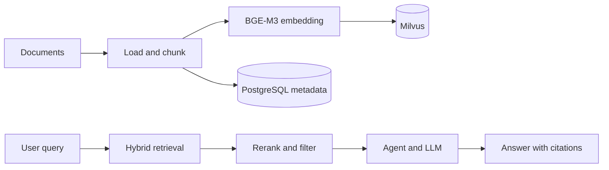

# RagMate

**Self-hosted RAG knowledge management for searchable documents and cited answers.**

[](https://www.python.org/downloads/)
[](https://fastapi.tiangolo.com/)
[](LICENSE)

[中文文档](README_zh.md)

RagMate is a self-hosted RAG application that turns PDF, DOCX, XLSX, TXT, and Markdown files into a searchable knowledge base. It combines hybrid vector search, reranking, agentic reasoning, streaming responses, and optional faithfulness checks—while keeping application data and infrastructure under your control.

## Highlights

- **Hybrid retrieval**: BGE-M3 dense + sparse search with RRF fusion.
- **Higher-quality answers**: cross-encoder reranking, adaptive filtering, contextual compression, and citations.
- **Agentic chat**: LangGraph/Deep Agents workflow with multi-turn sessions and SSE streaming.
- **Document operations**: multi-format parsing, heading-aware chunking, parent-child retrieval, deduplication, and batch ingestion.
- **Built-in evaluation**: optional RAGAS CLI for test-set generation, reports, and CI quality gates.
- **Self-hosted by design**: PostgreSQL, Redis, Milvus, and MinIO run through Docker Compose.

## Quick start

### Prerequisites

- Python 3.12+
- Docker Desktop or Docker Engine with Compose v2
- An OpenAI-compatible LLM endpoint and API key
- At least 8 GB RAM for CPU embedding; a GPU is recommended for larger collections

### 1. Start infrastructure

From the repository root:

```bash
docker compose up -d
docker compose ps
```

The stack exposes PostgreSQL (`5432`), Redis (`6379`), Milvus (`19530`), MinIO (`9000`/`9001`), and Attu (`8080`). The application itself runs on your host during development.

To stop services without deleting data:

```bash
docker compose stop
```

### 2. Install the backend

```bash
cd backend
python -m venv .venv
# macOS/Linux
source .venv/bin/activate
# Windows PowerShell: .venv\Scripts\Activate.ps1
python -m pip install --upgrade pip
pip install -e .
```

For evaluation commands, install the optional dependencies:

```bash
pip install -e ".[eval]"
```

### 3. Configure the application

```bash
cp .env.example .env
```

On Windows PowerShell, use `Copy-Item .env.example .env` instead. Edit `backend/.env` and set at least:

```env
LLM_API_KEY=your-api-key
LLM_MODEL=gpt-4o
# Optional: use any OpenAI-compatible provider
LLM_API_BASE_URL=https://api.openai.com/v1
```

The default database, Redis, and Milvus settings match the Docker Compose stack. See [`backend/.env.example`](backend/.env.example) for all available options.

### 4. Run RagMate

Run this command from the repository root (with the virtual environment activated):

```bash
uvicorn backend.app:app --reload --port 8000
```

Open [http://localhost:8000](http://localhost:8000) for the web UI. API documentation is available at [http://localhost:8000/docs](http://localhost:8000/docs).

## First-use workflow

1. Open the **Documents** tab and upload one or more supported files.
2. Trigger ingestion and wait for the status to become complete.
3. Open **Chat** and ask questions about the indexed documents.
4. Use the returned citations to inspect the source passages.

Supported formats: `.pdf`, `.docx`, `.xlsx`, `.xls`, `.txt`, and Markdown. Uploads are limited to 50 MB per file by default.

## API overview

| Area | Method | Endpoint | Purpose |
|---|---:|---|---|
| Chat | POST | `/chat` | Non-streaming answer |
| Chat | POST | `/chat/stream` | SSE streaming answer |
| Sessions | GET/DELETE | `/chat/sessions...` | List, inspect, or delete sessions |
| Documents | GET/POST/DELETE | `/documents...` | List, upload, or delete files |
| Ingestion | POST/GET | `/ingest`, `/ingest/status` | Start indexing and inspect progress |
| Health | GET | `/health`, `/ready` | Basic and dependency-aware checks |

Example chat request:

```bash
curl -X POST http://localhost:8000/chat \
  -H "Content-Type: application/json" \
  -d '{"message":"What is RAG?"}'
```

## Architecture


```mermaid
flowchart LR
    D[Documents] --> P[Load and chunk]
    P --> E[BGE-M3 embedding]
    E --> V[(Milvus)]
    P --> M[(PostgreSQL metadata)]
    Q[User query] --> R[Hybrid retrieval]
    R --> RR[Rerank and filter]
    RR --> A[Agent and LLM]
    A --> O[Answer with citations]
```

The query path uses dense and sparse ANN search, RRF fusion, BGE reranking, score-based filtering, contextual compression, and optional faithfulness verification. Simple queries may be routed directly to the LLM.

## Configuration essentials

| Variable | Default | Notes |
|---|---|---|
| `LLM_API_KEY` | required | LLM provider credential |
| `LLM_MODEL` | `gpt-4o` | Model exposed by the provider |
| `LLM_API_BASE_URL` | empty | Custom OpenAI-compatible endpoint |
| `EMBEDDING_DEVICE` | `cpu` | Set to `cuda` for GPU inference |
| `DATABASE_URL` | local PostgreSQL | Metadata and chat history |
| `REDIS_URL` | local Redis | Sessions and locks |
| `MILVUS_HOST` | `localhost` | Vector database host |
| `CHUNK_SIZE` | `1000` | Default chunk size |
| `RERANK_CANDIDATES` | `30` | Candidates passed to reranking |
| `FINAL_CONTEXT_K` | `15` | Maximum context chunks sent to the LLM |
| `FAITHFULNESS_CHECK` | `false` | Adds an extra verification LLM call when enabled |

For local models, set `LLM_API_BASE_URL` to the endpoint exposed by Ollama, LM Studio, or another compatible server.

## Evaluation

Install evaluation dependencies with `pip install -e ".[eval]"`, then run:

```bash
cd backend
ragmate-eval
```

For automation:

```bash
ragmate-eval generate --size 50 --output ../eval/testsets/testset.json
ragmate-eval evaluate --testset ../eval/testsets/testset.json \
  --report ../eval/reports/report.json --threshold 0.75
```

Metrics include faithfulness, answer relevancy, context precision/recall, and factual correctness.

## Development

```bash
cd backend
pip install -e ".[test]"
pytest -v
ruff check .
ruff format .
mypy .
```

The backend follows an API → application → domain/infrastructure layout. The zero-dependency frontend lives in [`frontend/`](frontend/), while generated evaluation data belongs in [`eval/`](eval/).

## Data, backup, and security

Docker volumes are stored under [`volumes/`](volumes/) and contain PostgreSQL, Redis, Milvus, and MinIO data. For a consistent backup, stop the stack first, copy the directory, then restart it.

Before exposing the service beyond localhost, configure `CORS_ORIGINS`, replace default infrastructure credentials, protect the API with an authentication layer, and review upload/rate-limit settings. RagMate validates requests and applies a default 50 MB upload limit, but it is not a complete internet-facing security boundary by itself.

## Troubleshooting

- `ready` is `degraded`: run `docker compose ps` and inspect `docker compose logs <service>`.
- Model download or CPU inference is slow: use a CUDA environment or configure a compatible remote embedding service.
- Chat returns no useful context: confirm ingestion completed and that `MILVUS_HOST`, `DATABASE_URL`, and `REDIS_URL` point to the running stack.
- Port conflicts: change the host-side ports in `docker-compose.yml` and update the matching `.env` values.

## License

MIT License. See [LICENSE](LICENSE).

## Acknowledgements

[FastAPI](https://fastapi.tiangolo.com/) · [LangChain](https://python.langchain.com/) · [Milvus](https://milvus.io/) · [BGE](https://github.com/FlagOpen/FlagEmbedding) · [RAGAS](https://docs.ragas.io/)
