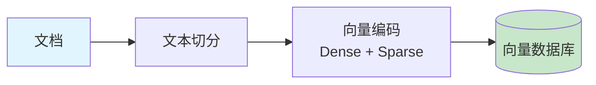
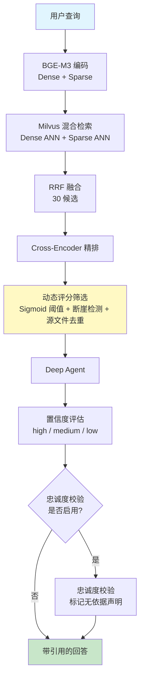

# RagMate

[English](README.md)

一个基于检索增强生成（RAG）的企业级知识管理系统。用户上传文档后，系统通过向量检索和大语言模型推理，从知识库中检索最相关内容并生成准确答案。

[](https://www.python.org/downloads/)
[](LICENSE)
[](https://fastapi.tiangolo.com/)

---

## 核心特性

- **混合检索** — Dense + Sparse 向量混合搜索（RRF 融合）+ 交叉编码器 Reranking + 动态评分筛选（sigmoid 概率阈值、分数断崖检测、同源自适应去重）+ 上下文压缩（句子级相关性筛选）
- **查询优化** — 查询上下文化（追问自动改写为自包含检索 query）+ 查询路由（简单查询跳过 Agent 直接回复）
- **检索置信度 & 忠诚度校验** — 基于检索质量的置信度标识（high/medium/low）+ 可选的忠诚度校验，标记无依据的声明（额外 LLM 调用）
- **Deep Agents** — 基于 LangGraph 的多轮推理 Agent，支持子 Agent 委派和复杂问题分解
- **流式输出** — SSE 实时逐 token 流式返回
- **多格式文档** — 支持 PDF、DOCX、XLSX、TXT、Markdown，内容 hash 自动去重
- **智能 Chunk** — 按文件类型自适应分块大小（PDF/DOCX/TXT/表格），Markdown 按标题层级切分，支持 Parent-child 分块（小找大检索），PDF 保留页码
- **多语言 Embedding** — BAAI/bge-m3（1024 维），本地部署，原生支持 dense + sparse 双向量
- **批量操作** — 多选文档批量入库或批量删除，带进度弹窗
- **灵活的 LLM 接入** — 通过 LangChain ChatOpenAI 接入任意兼容 OpenAI 格式的 API
- **评估 CLI** — 内置 RAGAS 评估，支持 CI/CD 质量门禁
- **本地部署** — 所有数据自托管，无外部依赖

---

## 架构

### 索引流程



- 文本切分：Markdown 按标题切分，其他格式 `RecursiveCharacterTextSplitter`
- 向量编码：dense（语义）+ sparse（关键词）双向量
- 向量数据库存储双向量 + 元数据（来源、页码、片段序号）

### 检索流程



- 查询上下文化：追问自动改写为自包含检索 query，提升多轮对话检索质量
- BGE-M3 一次编码同时输出 dense（语义）+ sparse（关键词）向量
- Milvus 并行 ANN 检索，RRF 融合排序，召回 30 候选
- Cross-encoder 精排后，句子级上下文压缩去除无关内容
- 动态评分筛选 4-15 个最优片段，核心来源自适应放宽上限
- Deep Agent 支持多步推理 + 子代理委派
- 检索置信度（high/medium/low）基于检索指标计算，前端展示置信度标识
- 可选忠诚度校验：验证回答中的每个声明是否有检索上下文支持（`FAITHFULNESS_CHECK` 控制，额外消耗一次 LLM 调用）

---

## 快速开始

### 环境要求

- Python 3.12+
- Docker Desktop（用于 Milvus、PostgreSQL、Redis）

### 1. 启动基础设施

```bash
docker-compose up -d
```

| 服务 | 端口 | 用途 |
|------|------|------|
| Milvus | 19530 | 向量数据库（dense + sparse） |
| Attu | 8080 | Milvus Web 管理界面 |
| PostgreSQL | 5432 | 文档元数据、对话历史 |
| Redis | 6379 | 会话缓存、分布式锁 |
| MinIO | 9001 | Milvus 对象存储后端 |

### 2. 安装依赖

```bash
cd backend
pip install -e .
```

安装 RAGAS 评估工具（可选）：

```bash
pip install -e ".[eval]"
```

### 3. 配置

```bash
cp .env.example .env
```

编辑 `.env`，配置 LLM API：

```env
LLM_MODEL=gpt-4o
LLM_API_KEY=your_api_key
LLM_API_BASE_URL=https://api.openai.com/v1
```

支持任意 OpenAI 兼容 API，例如 DeepSeek、MiMo 等：

```env
LLM_MODEL=deepseek-chat
LLM_API_KEY=your_key
LLM_API_BASE_URL=https://api.deepseek.com/v1
```

### 4. 启动服务

在项目根目录下运行：

```bash
uvicorn backend.app:app --reload --port 8000
```

浏览器打开 http://localhost:8000

---

## 使用

### Web UI

- **对话** — 基于知识库的流式问答，支持多轮对话
- **文档** — 上传文档、管理文档、触发入库

### RAGAS 评估

使用 RAGAS 指标评估 RAG 管道质量。需要先安装评估依赖并启动基础设施：

```bash
# 安装评估依赖
cd backend
pip install -e ".[eval]"

# 确保 Milvus、PostgreSQL、Redis 已启动
docker-compose up -d
```

交互模式（推荐）：

```bash
ragmate-eval
```

命令行模式（CI/CD 场景）：

```bash
# 生成测试集
ragmate-eval generate --size 50 --output eval/testsets/testset_v1.json

# 运行评估
ragmate-eval evaluate --testset eval/testsets/testset_v1.json --report eval/reports/report.json

# CI/CD 门禁 — 整体分数低于阈值时 exit code 非 0
ragmate-eval evaluate --testset eval/testsets/testset_v1.json --threshold 0.75
```

评估指标：Faithfulness（忠实度）、Answer Relevancy（答案相关性）、Context Precision（上下文精确率）、Context Recall（上下文召回率）、Factual Correctness（事实正确性）。

---

## API 参考

### 聊天

```
POST /chat
Body: { "message": "...", "session_id": "可选" }
Response: { "response": "...", "session_id": "...", "confidence": "high|medium|low", "unsupported_claims": [...] }
```

```
POST /chat/stream
Body: { "message": "...", "session_id": "可选" }
Response: text/event-stream
  data: {"token": "..."}
  data: {"done": true, "session_id": "...", "confidence": "high|medium|low", "unsupported_claims": [...]}
```

```
GET /chat/sessions
Response: { "sessions": [{ "session_id": "...", "first_message": "...", "created_at": "..." }] }
```

```
GET /chat/sessions/{session_id}
Response: { "session_id": "...", "messages": [{ "role": "...", "content": "...", "created_at": "..." }] }
```

```
DELETE /chat/sessions/{session_id}
Response: { "success": true }
```

### 文档

```
GET /documents
Response: { "documents": [{ "filename": "...", "size_bytes": ..., "status": "...", "chunk_count": ... }] }
```

```
POST /documents/upload
Body: multipart/form-data，字段名 "file"（支持 PDF/DOCX/XLSX/TXT/MD，最大 50MB）
Response: { "filename": "...", "status": "uploaded" }
```

```
DELETE /documents/{filename}
Response: { "success": true }
```

### 入库

```
POST /ingest
Body: { "filenames": ["file1.pdf", "file2.docx"] } （可选，不传则入库所有新文件）
Response: { "status": "started" | "already_running" }
```

```
GET /ingest/status
Response: { "status": "idle|running|success|failed", "document_count": ..., "chunk_count": ... }
```

### 系统

```
GET /health
Response: { "status": "ok" }

GET /ready
Response: { "status": "ready|degraded", "checks": { "milvus": ..., "postgresql": ..., "redis": ... } }
```

---

## 配置

所有配置通过 `.env` 文件或环境变量设置，使用 `pydantic-settings` 验证。

| 类别 | 变量 | 默认值 | 说明 |
|------|------|--------|------|
| **LLM** | `LLM_MODEL` | `gpt-4o` | 模型名称 |
| | `LLM_API_KEY` | | API Key |
| | `LLM_API_BASE_URL` | | 自定义 API 地址 |
| **Embedding** | `EMBEDDING_PROVIDER` | `huggingface` | `huggingface` 或 `openai` |
| | `EMBEDDING_MODEL` | `BAAI/bge-m3` | Embedding 模型 |
| | `EMBEDDING_DEVICE` | `cpu` | `cpu` 或 `cuda` |
| | `EMBEDDING_NORMALIZE` | `true` | 向量归一化 |
| | `HF_TOKEN` | | HuggingFace Token |
| **数据库** | `DATABASE_URL` | `postgresql+asyncpg://...` | PostgreSQL 连接 |
| | `REDIS_URL` | `redis://localhost:6379/0` | Redis 连接 |
| **Milvus** | `MILVUS_HOST` | `localhost` | 主机 |
| | `MILVUS_PORT` | `19530` | 端口 |
| | `MILVUS_COLLECTION` | `ragmate_docs` | Collection 名称 |
| **入库** | `CHUNK_SIZE` | `1000` | 默认文本分块大小 |
| | `CHUNK_OVERLAP` | `200` | 默认分块重叠 |
| | `CHUNK_SIZE_PDF` | `600` | PDF 分块大小 |
| | `CHUNK_SIZE_DOCX` | `800` | DOCX 分块大小 |
| | `CHUNK_SIZE_TXT` | `1000` | TXT 分块大小 |
| | `CHUNK_SIZE_TABLE` | `1500` | 表格/电子表格分块大小 |
| | `CHUNK_SIZE_PARENT` | `2500` | 父分块大小（小找大检索） |
| | `CHUNK_OVERLAP_PARENT` | `300` | 父分块重叠 |
| **查询处理** | `QUERY_CONTEXTUALIZE` | `true` | 检索前用 LLM 改写追问为自包含 query |
| | `QUERY_ROUTING_ENABLED` | `true` | 简单查询跳过 Agent 直接回复 |
| **检索** | `HYBRID_SEARCH_ENABLED` | `true` | 启用混合检索 |
| | `RERANKER_MODEL` | `BAAI/bge-reranker-v2-m3` | Reranker 模型 |
| | `RERANK_CANDIDATES` | `30` | rerank 候选池大小 |
| | `FINAL_CONTEXT_K` | `15` | 最终给 LLM 的最大片段数（硬上限） |
| | `RERANK_SCORE_THRESHOLD` | `0.3` | sigmoid 概率阈值（0-1） |
| | `CONTEXTUAL_COMPRESSION` | `true` | chunk 内句子级压缩，去除无关内容 |
| | `COMPRESSION_SCORE_THRESHOLD` | `0.4` | 句子保留阈值 |
| | `COMPRESSION_MIN_CHARS` | `300` | 低于此长度的 chunk 不压缩 |
| | `SOURCE_DOMINANCE_THRESHOLD` | `0.9` | 核心来源自适应放宽阈值 |
| | `SOURCE_DOMINANCE_BOOST` | `1.5` | 主导来源 chunk 上限倍数 |
| **生成** | `FAITHFULNESS_CHECK` | `false` | 生成后忠诚度校验（额外 LLM 调用） |
| **LangSmith** | `LANGSMITH_TRACING` | `false` | 启用追踪 |
| | `LANGSMITH_API_KEY` | | LangSmith API Key |

---

## 项目结构

```
RagMate/
├── docker-compose.yml
├── LICENSE / README.md / README_zh.md / CHANGELOG.md
├── eval/                          # RAGAS 评估数据
│   ├── testsets/                  # 生成的测试集
│   └── reports/                   # 评估报告
├── frontend/
│   ├── index.html
│   ├── style.css
│   └── app.js
└── backend/
    ├── pyproject.toml
    ├── .env.example
    ├── app.py                     # FastAPI 工厂、中间件、生命周期 (uvicorn backend.app:app)
    ├── domain/                    # 业务实体
    │   ├── errors.py              # 类型化错误层级
    │   ├── models.py              # ORM 模型（Document, ChatHistory）
    │   └── schemas.py             # Pydantic 请求/响应模型
    ├── infrastructure/            # 外部系统适配器
    │   ├── config.py              # 配置（pydantic-settings）
    │   ├── database.py            # SQLAlchemy 异步/同步引擎
    │   ├── redis_client.py        # Redis 会话 / 锁 / 状态
    │   ├── rate_limiter.py        # Redis 频率限制
    │   ├── streaming_llm.py       # ChatOpenAI 兼容工厂
    │   ├── model_factory.py       # LLM / Embedding 工厂
    │   ├── encoding.py            # BGE-M3 dense + sparse 编码
    │   └── milvus.py              # Milvus 客户端管理 + CRUD
    ├── core/                      # 领域逻辑
    │   ├── retriever.py           # 混合检索 + Reranking + 动态过滤
    │   ├── agent.py               # Deep Agent（系统提示 + retrieval_tool）
    │   └── prompts/               # Agent 系统提示
    ├── application/               # 用例 / 服务层
    │   ├── chat.py                # 聊天编排（同步 + 流式）
    │   ├── document_service.py    # 文档 CRUD
    │   ├── ingest_manager.py      # 入库任务生命周期（锁、异步）
    │   └── ingest/                # 入库管道
    │       ├── loaders.py         # 按扩展名加载文档
    │       ├── db_sync.py         # PostgreSQL 文档状态同步
    │       └── pipeline.py        # 入库主流程编排
    ├── api/                       # HTTP 路由
    │   ├── health.py              # /health, /ready
    │   ├── chat.py                # /chat, /chat/stream, /chat/sessions
    │   ├── documents.py           # /documents, /documents/upload
    │   └── ingest.py              # /ingest, /ingest/status
    ├── eval/                      # RAGAS 评估 CLI
    └── documents/                 # 文档存储目录
```

---

## 技术栈

| 组件 | 技术 | 说明 |
|------|------|------|
| Web 框架 | FastAPI + Uvicorn | ASGI，托管前端静态文件 |
| 前端 | HTML/CSS/JS | 零依赖原生前端 |
| LLM | LangChain ChatOpenAI | 接入任意 OpenAI 兼容 API |
| Embedding | BAAI/bge-m3 | 1024 维，多语言，dense + sparse 双向量 |
| 向量数据库 | Milvus 2.5 | 混合检索（dense + sparse + RRF） |
| Reranker | BAAI/bge-reranker-v2-m3 | 交叉编码器重排序 |
| Agent | LangGraph (Deep Agents) | 多轮推理 + 工具调用 |
| 追踪 | LangSmith | Agent 执行监控 |
| 缓存 | Redis | 会话状态 + 分布式锁 |
| 存储 | PostgreSQL | 文档元数据 + 对话历史 |

---

## 许可证

MIT License — 详见 [LICENSE](LICENSE)。
