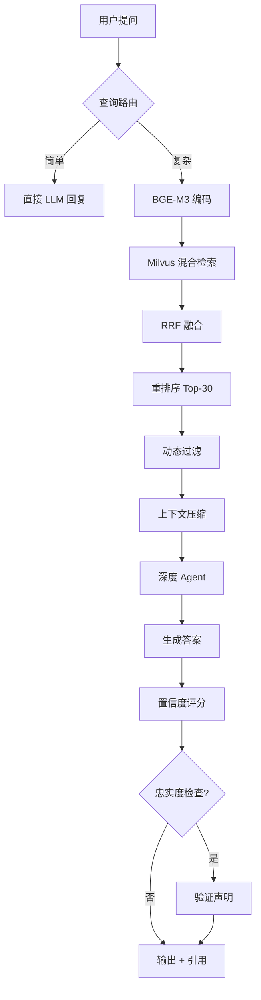

# RagMate

**企业级 RAG 知识管理系统**

[](https://www.python.org/downloads/)
[](LICENSE)
[](https://fastapi.tiangolo.com/)

---

## 🎯 什么是 RagMate？

RagMate 是一个**自托管的知识管理系统**，结合检索增强生成（RAG）技术与先进的向量搜索和 LLM 推理能力。上传文档，构建可搜索的知识库，获得带引用的精准答案——**所有数据完全本地存储**。

### 为什么选择 RagMate？

- ✅ **无厂商锁定** — 完全自托管，数据掌控在自己手中
- ✅ **生产就绪** — 混合检索、置信度评分、内置评测工具
- ✅ **开发者友好** — 清晰架构、完善文档、简易部署
- ✅ **企业级特性** — 多格式支持、批量操作、流式响应

---

## ✨ 核心功能

### 🔍 高级检索
- **混合搜索**：稠密（语义）+ 稀疏（关键词）向量 + RRF 融合
- **交叉编码器重排序**：BGE-Reranker-v2-m3 提升精度
- **动态过滤**：自适应阈值、来源去重、上下文压缩
- **查询优化**：自动改写追问、简单查询智能路由

### 🤖 智能 Agent
- **深度推理**：基于 LangGraph 的多轮 Agent，支持子 Agent 委派
- **流式输出**：实时 token-by-token SSE 响应
- **置信度评分**：基于检索质量的高/中/低徽章
- **忠实度检查**：可选验证，标记 unsupported claims

### 📄 文档管理
- **多格式支持**：PDF、DOCX、XLSX、TXT、Markdown
- **智能分块**：按文件类型自适应大小、父子检索、标题感知分割
- **内容去重**：基于哈希防止重复索引
- **批量操作**：多选文件批量入库/删除，带进度追踪

### 📊 内置评测
- **RAGAS 集成**：忠实度、答案相关性、上下文精确率/召回率
- **交互式 CLI**：生成测试集、运行评测、查看报告
- **CI/CD 门禁**：基于阈值的自动质量检查

---

## 🚀 快速开始

### 前置要求

- Python 3.12+
- Docker Desktop（用于基础设施服务）

### 1. 启动基础设施

```bash
docker-compose up -d
```

这将启动以下服务：
- **Milvus** (19530) — 向量数据库
- **PostgreSQL** (5432) — 元数据和聊天历史
- **Redis** (6379) — 会话缓存和分布式锁
- **MinIO** (9000/9001) — 对象存储
- **Attu** (8080) — Milvus 管理界面

### 2. 安装依赖

```bash
cd backend
pip install -e .
```

如需 RAGAS 评测（可选）：
```bash
pip install -e ".[eval]"
```

### 3. 配置环境

```bash
cp backend/.env.example backend/.env
```

编辑 `backend/.env`，填入你的 LLM 凭证：

```env
LLM_API_KEY=your-api-key-here
LLM_MODEL=gpt-4o
LLM_API_BASE_URL=https://api.openai.com/v1
```

支持任何 OpenAI 兼容的 API：DeepSeek、Anthropic、Claude 等。

### 4. 启动服务器

从项目根目录运行：

```bash
uvicorn backend.app:app --reload --port 8000
```

在浏览器中打开 **http://localhost:8000**。

---

## 📖 使用指南

### Web 界面

**对话标签页**：针对文档提问，实时流式响应  
**文档标签页**：上传文件、管理知识库、触发索引

### API 端点

#### 聊天
```http
POST /chat
{
  "message": "什么是 RAG？",
  "session_id": "可选"
}

POST /chat/stream  # Server-Sent Events 流式响应
GET  /chat/sessions
GET  /chat/sessions/{session_id}
DELETE /chat/sessions/{session_id}
```

#### 文档
```http
GET    /documents
POST   /documents/upload  # multipart/form-data，最大 50MB
DELETE /documents/{filename}
```

#### 索引
```http
POST /ingest              # 触发索引
GET  /ingest/status       # 检查进度
```

#### 健康检查
```http
GET /health   # 基础健康检查
GET /ready    # 详细服务就绪状态
```

完整 API 文档：**http://localhost:8000/docs**（Swagger UI）

---

## 🏗️ 系统架构

### 索引流程


1. **分块**：按文件类型智能分割（PDF/DOCX/TXT/表格/Markdown）
2. **编码**：BGE-M3 生成双向量（1024 维稠密 + 稀疏）
3. **存储**：Milvus 存向量，PostgreSQL 跟踪元数据

### 查询流程



关键阶段：
1. **查询路由**：简单查询跳过检索以提升速度
2. **混合检索**：并行稠密 + 稀疏 ANN → RRF 融合
3. **重排序**：交叉编码器对 top-30 候选评分
4. **过滤**：Sigmoid 阈值 + 分数差距检测 + 来源去重
5. **压缩**：句子级别相关性过滤
6. **生成**：深度 Agent 多轮推理
7. **验证**：可选忠实度检查（额外 1 次 LLM 调用）

---

## ⚙️ 配置说明

所有设置通过环境变量或 `.env` 文件配置，由 `pydantic-settings` 验证。

### 必需配置

| 变量 | 默认值 | 说明 |
|------|--------|------|
| `LLM_API_KEY` | *(必填)* | LLM 提供商 API 密钥 |
| `LLM_MODEL` | `gpt-4o` | 模型名称 |
| `LLM_API_BASE_URL` | | 自定义端点（如 DeepSeek、Claude） |
| `EMBEDDING_DEVICE` | `cpu` | `cpu` 或 `cuda`（GPU 加速） |
| `DATABASE_URL` | `postgresql+asyncpg://...` | PostgreSQL 连接 |
| `REDIS_URL` | `redis://localhost:6379/0` | Redis 连接 |
| `MILVUS_HOST` | `localhost` | Milvus 服务器地址 |

### 调优参数

| 类别 | 变量 | 默认值 | 影响 |
|------|------|--------|------|
| **分块** | `CHUNK_SIZE` | 1000 | 越大上下文越多，精度可能下降 |
| | `CHUNK_OVERLAP` | 200 | 保持块间连续性 |
| | `CHUNK_SIZE_PDF` | 600 | 技术文档使用较小块 |
| **检索** | `RERANK_CANDIDATES` | 30 | 越多质量越好，速度越慢 |
| | `FINAL_CONTEXT_K` | 15 | 发送给 LLM 的最大块数 |
| | `RERANK_SCORE_THRESHOLD` | 0.3 | 丢弃低相关性结果 |
| **Agent** | `QUERY_CONTEXTUALIZE` | `true` | 改写追问为独立查询 |
| | `FAITHFULNESS_CHECK` | `false` | 验证答案准确性（+1 次 LLM 调用） |

查看 `.env.example` 了解全部 30+ 配置项。

---

## 🧪 评测系统

内置 RAGAS 评测，用于衡量 RAG 管道质量。

### 交互模式

```bash
cd backend
ragmate-eval
```

引导式工作流：生成测试集 → 运行评测 → 查看报告。

### CI/CD 模式

```bash
# 从已上传文档生成测试集
ragmate-eval generate --size 50 --output eval/testsets/testset.json

# 运行评测
ragmate-eval evaluate --testset eval/testsets/testset.json \
  --report eval/reports/report.json

# 质量门禁（低于阈值则退出码非零）
ragmate-eval evaluate --testset eval/testsets/testset.json \
  --threshold 0.75
```

**评测指标**：忠实度、答案相关性、上下文精确率、上下文召回率、事实正确性

---

## 🛠️ 技术栈

| 层级 | 技术 | 用途 |
|-------|-----------|---------|
| **Web 框架** | FastAPI + Uvicorn | 异步 REST API，提供前端静态文件 |
| **前端** | 原生 HTML/CSS/JS | 零依赖，Apple HIG 风格 UI |
| **LLM** | LangChain ChatOpenAI | 任意 OpenAI 兼容 API |
| **嵌入模型** | BAAI/bge-m3 | 1024 维多语言双向量 |
| **向量数据库** | Milvus 2.5 | 混合检索（稠密 + 稀疏 + RRF） |
| **重排序器** | BAAI/bge-reranker-v2-m3 | 交叉编码器精确排序 |
| **Agent** | LangGraph (Deep Agents) | 多轮推理 + 工具调用 |
| **数据库** | PostgreSQL 15 | 文档元数据、聊天历史 |
| **缓存** | Redis 7 | 会话状态、分布式锁 |
| **存储** | MinIO | Milvus 对象存储后端 |
| **追踪** | LangSmith（可选） | Agent 执行监控 |

---

## 📂 项目结构

```
RagMate/
├── docker-compose.yml          # 基础设施编排
├── README.md                   # 本文件
├── backend/
│   ├── app.py                  # FastAPI 工厂、中间件、生命周期
│   │
│   ├── api/                    # HTTP 路由处理器
│   │   ├── chat.py            # /chat, /chat/stream, /chat/sessions
│   │   ├── documents.py       # /documents CRUD
│   │   ├── ingest.py          # /ingest 状态
│   │   └── deps.py            # 依赖注入助手
│   │
│   ├── domain/                 # 业务实体
│   │   ├── models.py          # SQLAlchemy ORM 模型
│   │   ├── schemas.py         # Pydantic 验证器
│   │   └── errors.py          # 类型化错误层次
│   │
│   ├── infrastructure/         # 外部适配器
│   │   ├── config.py          # pydantic-settings 配置
│   │   ├── database.py        # PostgreSQL 异步引擎
│   │   ├── redis_client.py    # Redis 会话/锁客户端
│   │   ├── milvus.py          # Milvus 向量库操作
│   │   ├── encoding.py        # BGE-M3 编码器
│   │   └── model_factory.py   # LLM 工厂
│   │
│   ├── core/                   # 领域逻辑
│   │   ├── retriever.py       # 混合检索 + 重排序 + 过滤
│   │   ├── agent.py           # 深度 Agent（LangGraph）
│   │   └── prompts/           # 系统提示模板
│   │
│   ├── application/            # 用例
│   │   ├── chat.py            # 聊天编排（同步 + 流式）
│   │   ├── document_service.py # 文档 CRUD
│   │   ├── ingest_manager.py  # 索引生命周期管理
│   │   └── ingest/            # 索引管道
│   │       ├── loaders.py     # PDF/DOCX/XLSX 解析器
│   │       ├── db_sync.py     # PostgreSQL 同步
│   │       └── pipeline.py    # 主编排器
│   │
│   └── eval/                   # RAGAS 评测 CLI
│       ├── cli.py             # 命令行接口
│       ├── metrics.py         # 指标计算
│       └── report.py          # 报告生成
│
├── frontend/                   # Web UI（零依赖）
│   ├── index.html
│   ├── style.css              # Apple HIG 设计系统
│   └── app.js
│
└── eval/                       # 评测数据
    ├── testsets/              # 生成的测试集
    └── reports/               # 评测报告
```

---

## 🔒 安全性

- **自托管**：所有数据本地存储，无外部依赖
- **上传限制**：最大 50MB 文件大小（通过 ASGI 中间件强制执行）
- **速率限制**：基于 Redis 的每 IP 限流
- **请求追踪**：每个请求 UUID，便于审计
- **输入验证**：所有 API 端点使用 Pydantic 模式
- **CORS 控制**：可配置允许的源

---

## 🧩 开发指南

### 运行测试

```bash
cd backend
pip install -e ".[test]"
pytest -v
```

### 代码质量

```bash
# 类型检查
mypy backend/

# 代码检查
ruff check backend/

# 格式化
ruff format backend/
```

### 追踪（可选）

启用 LangSmith 进行 Agent 执行监控：

```env
LANGSMITH_TRACING=true
LANGSMITH_API_KEY=your-key
LANGSMITH_PROJECT=ragmate
```

---

## ❓ 常见问题

**Q: 可以使用本地 LLM 吗？**  
A: 可以！将 `LLM_API_BASE_URL` 设置为本地端点（如 Ollama、LM Studio）。

**Q: 需要多少内存？**  
A: CPU 模式最低 8GB。BGE-M3 嵌入模型约需 2GB。生产环境建议使用 GPU。

**Q: 支持哪些文件格式？**  
A: PDF、DOCX、XLSX/XLS、TXT、Markdown。电子表格中的表格会原样保留。

**Q: 可以自定义分块吗？**  
A: 可以，在 `.env` 中调整 `CHUNK_SIZE_*` 和 `CHUNK_OVERLAP_*`。

**Q: 如何备份数据？**  
A: 备份 `volumes/` 目录（PostgreSQL、Milvus、MinIO 数据）。为保证一致性，请先停止服务。

---

## 📝 许可证

MIT 许可证 — 详见 [LICENSE](LICENSE)。

---

## 🙌 致谢

本项目基于以下优秀的开源工具构建：
- [FastAPI](https://fastapi.tiangolo.com/)
- [LangChain](https://python.langchain.com/)
- [Milvus](https://milvus.io/)
- [BGE Models](https://github.com/FlagOpen/FlagEmbedding)
- [RAGAS](https://docs.ragas.ai/)

---

**准备好构建你的知识库了吗？** 从 `docker-compose up -d` 开始 🚀
