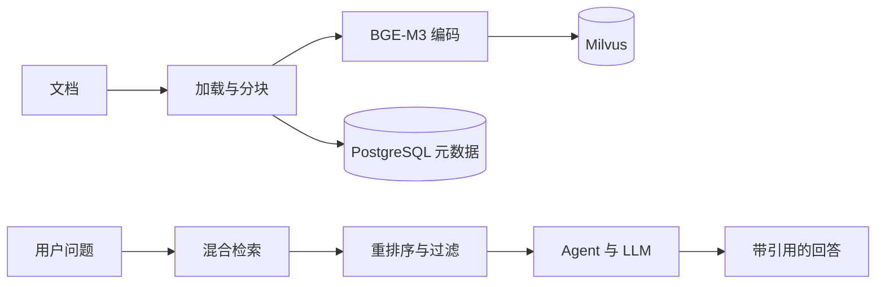

# RagMate

**面向文档检索与引用式问答的自托管 RAG 知识管理系统。**

[](https://www.python.org/downloads/)
[](https://fastapi.tiangolo.com/)
[](LICENSE)

[English](README.md)

RagMate 是一个自托管 RAG 应用，可将 PDF、DOCX、XLSX、TXT 和 Markdown 文件构建为可搜索的知识库。它结合混合向量检索、重排序、Agent 推理、流式响应和可选的忠实度检查，同时让应用数据与基础设施保持在你的控制范围内。

## 核心能力

- **混合检索**：BGE-M3 稠密 + 稀疏检索，并使用 RRF 融合结果。
- **更高质量的回答**：交叉编码器重排序、自适应过滤、上下文压缩和引用。
- **Agent 对话**：基于 LangGraph/Deep Agents 的多轮会话与 SSE 流式输出。
- **文档管理**：多格式解析、标题感知分块、父子检索、去重和批量入库。
- **内置评测**：可选 RAGAS CLI，支持测试集、报告和 CI 质量门禁。
- **自托管部署**：PostgreSQL、Redis、Milvus 和 MinIO 通过 Docker Compose 管理。

## 快速开始

### 前置要求

- Python 3.12+
- Docker Desktop 或支持 Compose v2 的 Docker Engine
- 一个 OpenAI 兼容的 LLM 接口及 API Key
- CPU 模式建议至少 8 GB 内存；较大知识库建议使用 GPU

### 1. 启动基础设施

在项目根目录执行：

```bash
docker compose up -d
docker compose ps
```

服务端口：PostgreSQL `5432`、Redis `6379`、Milvus `19530`、MinIO `9000/9001`、Attu `8080`。开发时应用本身运行在宿主机上。

停止服务但保留数据：

```bash
docker compose stop
```

### 2. 安装后端依赖

```bash
cd backend
python -m venv .venv
# macOS/Linux
source .venv/bin/activate
# Windows PowerShell：.venv\Scripts\Activate.ps1
python -m pip install --upgrade pip
pip install -e .
```

如需运行评测：

```bash
pip install -e ".[eval]"
```

### 3. 配置环境变量

仍在 `backend` 目录时执行：

```bash
cp .env.example .env
```

Windows PowerShell 使用 `Copy-Item .env.example .env`。编辑 `backend/.env`，至少填写：

```env
LLM_API_KEY=your-api-key
LLM_MODEL=gpt-4o
# 可选：使用任意 OpenAI 兼容服务
LLM_API_BASE_URL=https://api.openai.com/v1
```

默认数据库、Redis 和 Milvus 配置与 Docker Compose 保持一致。完整配置项见 [`backend/.env.example`](backend/.env.example)。

### 4. 启动 RagMate

回到项目根目录，并确保虚拟环境仍处于激活状态：

```bash
uvicorn backend.app:app --reload --port 8000
```

打开 [http://localhost:8000](http://localhost:8000) 使用 Web 界面；API 文档位于 [http://localhost:8000/docs](http://localhost:8000/docs)。

## 第一次使用

1. 打开 **Documents** 标签页，上传一个或多个支持的文件。
2. 触发入库，等待状态变为完成。
3. 打开 **Chat**，针对已索引文档提问。
4. 通过返回的引用查看原始内容片段。

支持格式：`.pdf`、`.docx`、`.xlsx`、`.xls`、`.txt` 和 Markdown。默认单文件上传上限为 50 MB。

## API 概览

| 模块 | 方法 | 端点 | 用途 |
|---|---:|---|---|
| 对话 | POST | `/chat` | 非流式问答 |
| 对话 | POST | `/chat/stream` | SSE 流式问答 |
| 会话 | GET/DELETE | `/chat/sessions...` | 查看、管理会话 |
| 文档 | GET/POST/DELETE | `/documents...` | 列出、上传、删除文档 |
| 入库 | POST/GET | `/ingest`、`/ingest/status` | 启动索引、查看进度 |
| 健康检查 | GET | `/health`、`/ready` | 基础及依赖就绪检查 |

示例：

```bash
curl -X POST http://localhost:8000/chat \
  -H "Content-Type: application/json" \
  -d '{"message":"什么是 RAG？"}'
```

## 系统架构


```mermaid
flowchart LR
    D[文档] --> P[加载与分块]
    P --> E[BGE-M3 编码]
    E --> V[(Milvus)]
    P --> M[(PostgreSQL 元数据)]
    Q[用户问题] --> R[混合检索]
    R --> RR[重排序与过滤]
    RR --> A[Agent 与 LLM]
    A --> O[带引用的回答]
```

查询流程包括稠密/稀疏 ANN 检索、RRF 融合、BGE 重排序、基于分数的过滤、上下文压缩和可选的忠实度验证。简单查询可直接路由到 LLM，以降低延迟。

## 关键配置

| 变量 | 默认值 | 说明 |
|---|---|---|
| `LLM_API_KEY` | 必填 | LLM 服务凭证 |
| `LLM_MODEL` | `gpt-4o` | 服务商提供的模型名称 |
| `LLM_API_BASE_URL` | 空 | 自定义 OpenAI 兼容端点 |
| `EMBEDDING_DEVICE` | `cpu` | GPU 环境可设为 `cuda` |
| `DATABASE_URL` | 本地 PostgreSQL | 元数据和聊天历史 |
| `REDIS_URL` | 本地 Redis | 会话和锁 |
| `MILVUS_HOST` | `localhost` | 向量数据库地址 |
| `CHUNK_SIZE` | `1000` | 默认分块大小 |
| `RERANK_CANDIDATES` | `30` | 进入重排序的候选数 |
| `FINAL_CONTEXT_K` | `15` | 发送给 LLM 的最大上下文块数 |
| `FAITHFULNESS_CHECK` | `false` | 开启后会额外调用一次 LLM 验证 |

如需使用 Ollama、LM Studio 等本地模型，将 `LLM_API_BASE_URL` 设置为其 OpenAI 兼容接口地址。

## 评测

安装 `pip install -e ".[eval]"` 后运行：

```bash
cd backend
ragmate-eval
```

自动化示例：

```bash
ragmate-eval generate --size 50 --output ../eval/testsets/testset.json
ragmate-eval evaluate --testset ../eval/testsets/testset.json \
  --report ../eval/reports/report.json --threshold 0.75
```

评测指标包括忠实度、答案相关性、上下文精确率/召回率和事实正确性。

## 开发

```bash
cd backend
pip install -e ".[test]"
pytest -v
ruff check .
ruff format .
mypy .
```

后端采用 API → application → domain/infrastructure 分层；零依赖前端位于 [`frontend/`](frontend/)，评测数据位于 [`eval/`](eval/)。

## 数据、备份与安全

Docker 数据卷位于 [`volumes/`](volumes/)，包含 PostgreSQL、Redis、Milvus 和 MinIO 数据。为保证备份一致性，请先停止服务，再复制该目录，完成后重新启动服务。

如果要从 localhost 暴露到外部网络，请配置 `CORS_ORIGINS`、替换基础设施默认密码、增加 API 认证，并检查上传和限流设置。RagMate 提供请求校验和默认 50 MB 上传限制，但本身不是完整的公网安全边界。

## 常见问题

- `ready` 返回 `degraded`：执行 `docker compose ps`，并查看 `docker compose logs <service>`。
- 模型下载或 CPU 推理很慢：使用 CUDA，或配置兼容的远程嵌入服务。
- 对话没有检索到内容：确认入库已完成，并检查 `MILVUS_HOST`、`DATABASE_URL`、`REDIS_URL` 是否指向正在运行的服务。
- 端口冲突：修改 `docker-compose.yml` 左侧宿主机端口，并同步更新 `.env`。

## 许可证

MIT License，详见 [LICENSE](LICENSE)。

## 致谢

[FastAPI](https://fastapi.tiangolo.com/) · [LangChain](https://python.langchain.com/) · [Milvus](https://milvus.io/) · [BGE](https://github.com/FlagOpen/FlagEmbedding) · [RAGAS](https://docs.ragas.io/)
